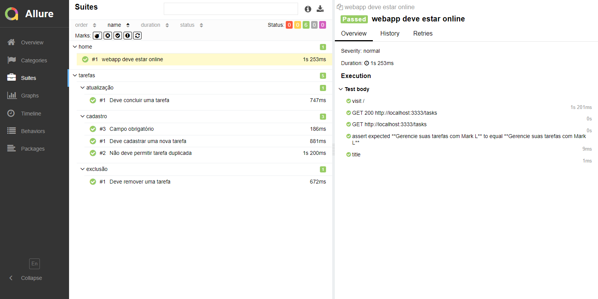
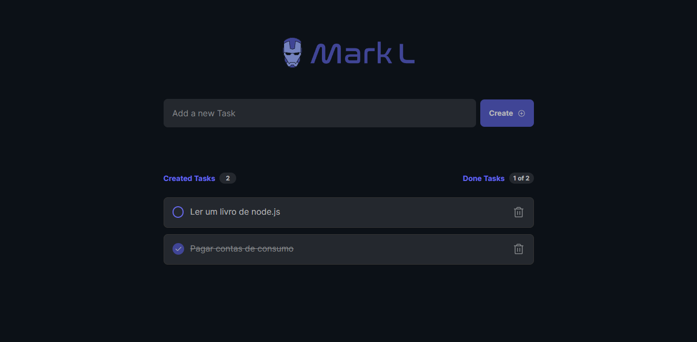
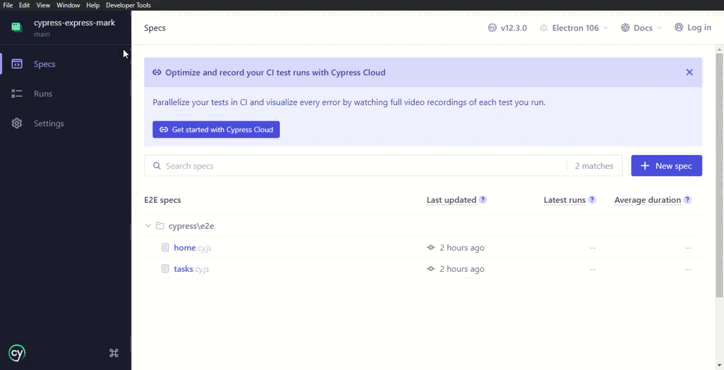

<h1 align="center">📈 Cypress Test: To do</h1>

  <strong>Testes automatizados com Cypress para aplicações web feito no curso Cypress Express da QAXPERIENCE</strong>
   

  
Relatório da aplicação no Allure Reports

   
  

  
Aplicação realizada a automação

   
  

  
Teste automatizado no Cypress

   
  

## Tecnologias e Ferramentas: 🚀
- Cypress
- Allure Reports

